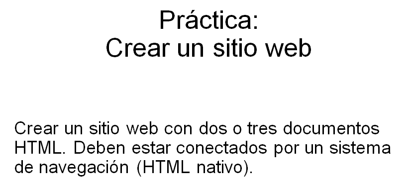

# The Truth Journal 

Este primer practico constiste en la creacion de una pagina web estatica con HTML y CSS, usando para su construccion el framework NestJS, de manera de poder tener el mismo en un servidor.

## Requisitos previos

Se debera contar con el programa **Visual Studio Code**, e instalar **Node JS** en el entorno de desarrollo. También, es requisito tener descargado **GIT**, que facilita la interación entre nuestro proyecto y el repositorio de GitHub.

## Instrucciones de Instalacion

1.  Clonar el repositorio del proyecto desde  [GitHub](https://github.com/eSalazar84/The-Truth-Journal.git)
2.  Ya en nuestra PC, abrir la terminal de Git, se debe escribir el comando

> `$ git clone https://github.com/eSalazar84/The-Truth-Journal.git`

3.  Ya con el proyecto descargado, abrir Visual Studio Code, y en la terminal del programa, se deberá instalar todas las dependencias del proyecto, para que funcione correctamente. con el comando:

> `npm install`

4. Para correr el codigo en ambiente de desarrollo

> `npm run start`

5. Si queres correr el codigo en modo watch:

> `npm run start:dev`

6. Para ver el sitio web, abri tu navegador preferido y en la barra de
direcciones, ingresa:

> `http://localhost:3000`